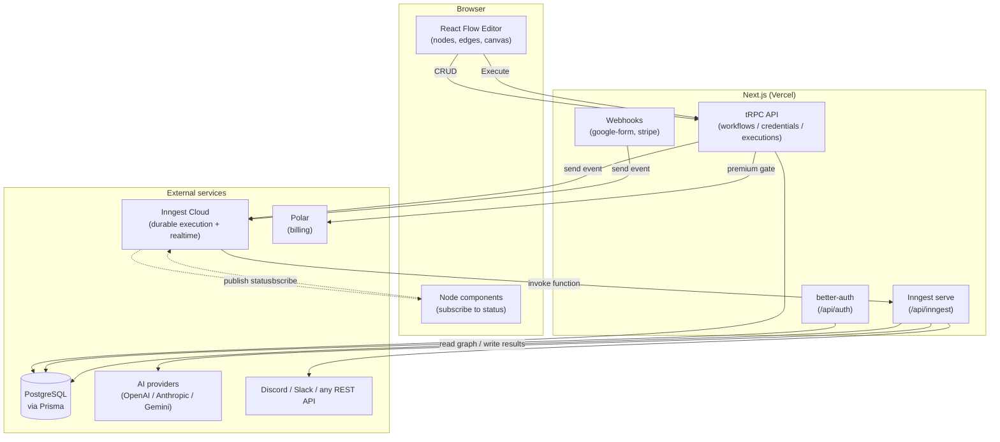
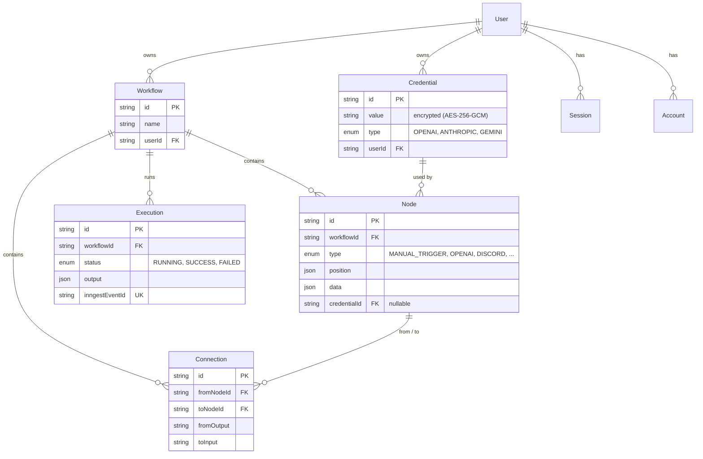
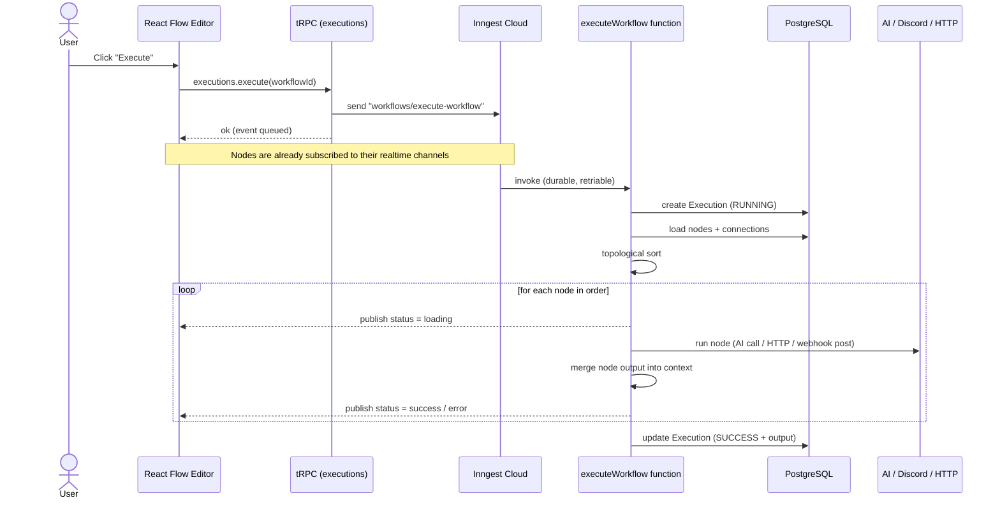
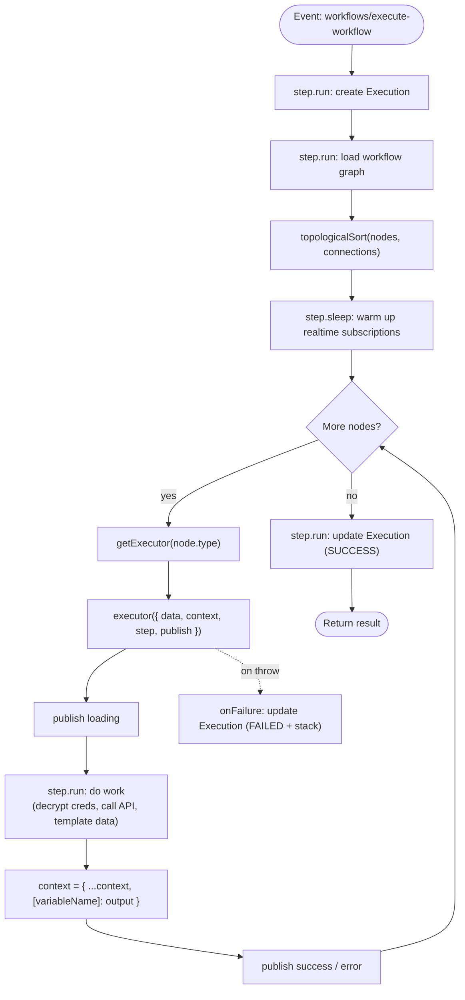
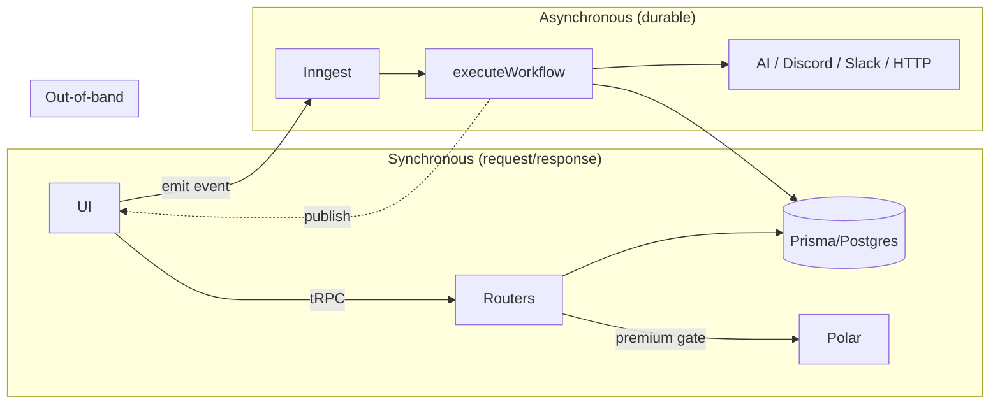

# FlowBuilder

### 🌐 Live demo: **[flow-builder-snowy.vercel.app](https://flow-builder-snowy.vercel.app/)**

> An n8n-style visual workflow automation platform. Build automations on an infinite canvas by wiring **trigger** and **action** nodes together, then run them as **durable, observable background jobs** with live per-node status streamed back to the UI in real time.

FlowBuilder lets you connect AI models (OpenAI, Anthropic, Google Gemini), HTTP APIs, and messaging tools (Discord, Slack) into automated pipelines. Workflows are stored as a graph of nodes and connections, executed in dependency order by a durable execution engine, and the result of each node is threaded into the next so later nodes can reference earlier output through templating.

---

## ✨ Features

### Workflow building
- **Visual drag-and-drop editor** — infinite canvas powered by React Flow, with custom nodes, handles, and connection edges.
- **Graph-based workflows** — every workflow is a set of nodes + connections persisted in PostgreSQL.
- **Topological execution** — nodes run in dependency order; cycles are detected and rejected.
- **Data threading + templating** — each node writes its output into a shared context; downstream nodes reference upstream values with Handlebars templates (e.g. `{{ aiResponse.text }}`).

### Node catalog

| Category | Node | Description |
|----------|------|-------------|
| **Trigger** | Manual Trigger | Starts a workflow when you click **Execute**. |
| **Trigger** | Google Form Trigger | Starts a workflow from a Google Form submission webhook. |
| **Trigger** | Stripe Trigger | Starts a workflow from a Stripe event webhook. |
| **Action** | HTTP Request | Calls any REST endpoint (GET/POST/PUT/PATCH/DELETE) with a templated body. |
| **Action** | OpenAI | Generates text with OpenAI models via the Vercel AI SDK. |
| **Action** | Anthropic | Generates text with Claude models. |
| **Action** | Gemini | Generates text with Google Gemini models. |
| **Action** | Discord | Posts a message to a Discord channel via webhook. |
| **Action** | Slack | Posts a message to Slack. |

### Execution & observability
- **Durable background execution** — workflows run on Inngest, with automatic retries and step-level memoization (no lost progress on transient failures).
- **Live per-node status** — `loading` / `success` / `error` states stream to the canvas in real time via Inngest Realtime.
- **Execution history** — every run is recorded with status, output, and error/stack for debugging.

### Platform
- **Authentication** — email/password plus GitHub and Google social login (better-auth).
- **Billing & subscriptions** — Polar integration; premium nodes/actions are gated behind an active subscription.
- **Encrypted credentials** — API keys are encrypted at rest (AES-256-GCM) and only decrypted at execution time.
- **Error monitoring** — Sentry instrumentation across client and server.

---

## 🧱 Tech Stack

| Layer | Technology |
|-------|------------|
| **Framework** | Next.js 16 (App Router, Turbopack), React 19, TypeScript |
| **Canvas / editor** | React Flow (`@xyflow/react`) |
| **API layer** | tRPC + TanStack Query (superjson transformer) |
| **Client state** | Jotai (editor state), nuqs (URL state) |
| **Database** | PostgreSQL + Prisma 7 (`@prisma/adapter-pg`) |
| **Auth** | better-auth (email/password, GitHub, Google) |
| **Billing** | Polar (`@polar-sh/better-auth`) |
| **Background jobs** | Inngest (durable functions, step model, retries) |
| **Realtime** | Inngest Realtime (per-node status channels) |
| **AI** | Vercel AI SDK (`@ai-sdk/openai`, `@ai-sdk/anthropic`, `@ai-sdk/google`) |
| **Templating** | Handlebars |
| **HTTP client** | ky |
| **Encryption** | cryptr (AES-256-GCM) |
| **UI** | Tailwind CSS v4, shadcn/ui (Radix primitives), lucide-react |
| **Monitoring** | Sentry |

---

## 🏗️ Architecture

### System overview

FlowBuilder is a single Next.js app whose work splits into three planes: the **UI/editor**, a **synchronous API plane** (tRPC for CRUD), and an **asynchronous execution plane** (Inngest for running workflows). Real-time status flows back to the browser out-of-band over Inngest Realtime.



### Data model

Workflows are graphs: `Node` rows are vertices, `Connection` rows are directed edges, and each run is an `Execution`. Credentials are encrypted and optionally linked to AI nodes.



### Execution flow (end to end)

When you press **Execute**, the API only *emits an event*; the heavy lifting happens asynchronously inside a durable Inngest function. Meanwhile the browser is already subscribed to each node's realtime channel, so status appears live as the engine progresses.



### The execution engine internals

The engine lives in [`src/inngest/functions.ts`](src/inngest/functions.ts). Each node `type` maps to an **executor** via a registry, and a shared `context` object is threaded through every node — that's how a Discord node can read what the OpenAI node produced.



**Key design points**

- **Node executor registry** — [`executor-registry.ts`](src/features/executions/lib/executor-registry.ts) maps each `NodeType` to its executor function, so adding a node type is: add the enum, a channel, a node component, and an executor.
- **Context threading** — each executor returns a new `context` with its result stored under the node's configured `variableName`. Downstream nodes interpolate it with Handlebars (`{{ variableName.text }}`).
- **Durability** — `step.run(...)` results are memoized by Inngest; on retry, completed steps are replayed from cache rather than re-executed, and the function retries up to 3 times.
- **Realtime status** — each node type has a dedicated channel under [`src/inngest/channels/`](src/inngest/channels/). Executors `publish` status; node components subscribe via [`use-node-status.ts`](src/features/executions/hooks/use-node-status.ts). A warm-up `step.sleep` lets browser subscriptions connect before the first node publishes (Inngest Realtime is ephemeral pub/sub with no replay).
- **Credential security** — secrets are stored encrypted ([`encryption.ts`](src/lib/encryption.ts)) and decrypted only inside the executor at run time.

### Request planes at a glance



---

## 📁 Project structure

```
src/
├── app/                      # Next.js App Router
│   ├── (auth)/               # login / signup
│   ├── (dashboard)/          # editor + workflows / credentials / executions
│   └── api/
│       ├── auth/             # better-auth handler
│       ├── inngest/          # Inngest serve endpoint
│       ├── trpc/             # tRPC handler
│       └── webhooks/         # google-form, stripe
├── features/                 # feature-sliced modules
│   ├── auth/
│   ├── credentials/          # encrypted API keys (components + tRPC router)
│   ├── editor/               # React Flow canvas, store, execute button
│   ├── executions/           # node components, executors, registry, realtime hook
│   ├── triggers/             # trigger node components + executors
│   ├── subscriptions/        # Polar billing hooks
│   └── workflows/            # workflow CRUD + list
├── inngest/
│   ├── client.ts             # Inngest client (+ realtime middleware)
│   ├── functions.ts          # executeWorkflow engine
│   ├── utils.ts              # topological sort + send helper
│   └── channels/             # one realtime channel per node type
├── lib/                      # auth, db, encryption, polar, utils
├── trpc/                     # tRPC init, routers, client/server setup
└── generated/prisma/         # generated Prisma client
```

---

## 🚀 Getting Started

### Prerequisites
- Node.js 20+
- A PostgreSQL database
- Accounts/keys for the services you want to use: Inngest, Polar, and AI providers (OpenAI / Anthropic / Google)

### Environment variables

Create a `.env` file:

```bash
# Database
DATABASE_URL="postgresql://..."

# Credential encryption (MUST be identical across all environments —
# changing it makes previously-encrypted credentials undecryptable)
ENCRYPTION_KEY="a-long-random-secret"

# Auth (better-auth)
GITHUB_CLIENT_ID="..."
GITHUB_CLIENT_SECRET="..."
GOOGLE_CLIENT_ID="..."
GOOGLE_CLIENT_SECRET="..."

# Billing (Polar)
POLAR_ACCESS_TOKEN="..."
POLAR_SUCCESS_URL="http://localhost:3000/..."

# Inngest (for production / Inngest Cloud)
INNGEST_EVENT_KEY="..."
INNGEST_SIGNING_KEY="..."
```

> ⚠️ **`ENCRYPTION_KEY` must match in every environment.** If local and production use different keys (while sharing a database), workflows fail at run time with `Unsupported state or unable to authenticate data` when decrypting credentials.

### Install & run

```bash
npm install

# generate Prisma client + apply schema
npx prisma generate
npx prisma db push

# run Next.js and the Inngest dev server together
npm run dev:all
# or individually:
npm run dev          # Next.js (http://localhost:3000)
npm run inngest:dev  # Inngest dev server
```

For local webhook testing (Google Form / Stripe triggers), expose your dev server:

```bash
npm run ngrok:dev
```

---

## 🔌 Extending: adding a new node type

1. Add the value to the `NodeType` enum in [`prisma/schema.prisma`](prisma/schema.prisma).
2. Create a realtime channel in [`src/inngest/channels/`](src/inngest/channels/).
3. Build the node component (under `features/executions/components/` or `features/triggers/components/`).
4. Write the executor and register it in [`executor-registry.ts`](src/features/executions/lib/executor-registry.ts).
5. Add the channel to the `channels` array in [`executeWorkflow`](src/inngest/functions.ts).

---

## 📦 Deployment

Deployed on **Vercel**. Checklist:

- Set **all** environment variables in the Vercel dashboard (especially `ENCRYPTION_KEY`, matching any other environment that shares the database).
- Connect the app to **Inngest Cloud** (`INNGEST_EVENT_KEY` / `INNGEST_SIGNING_KEY`) so the `/api/inngest` endpoint is registered.
- Configure Polar and OAuth callback URLs for the production domain.
